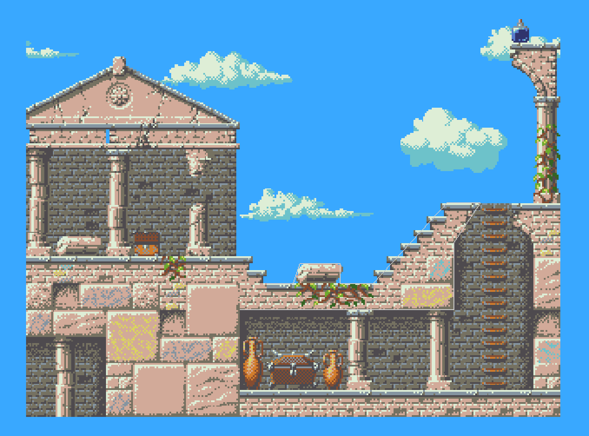
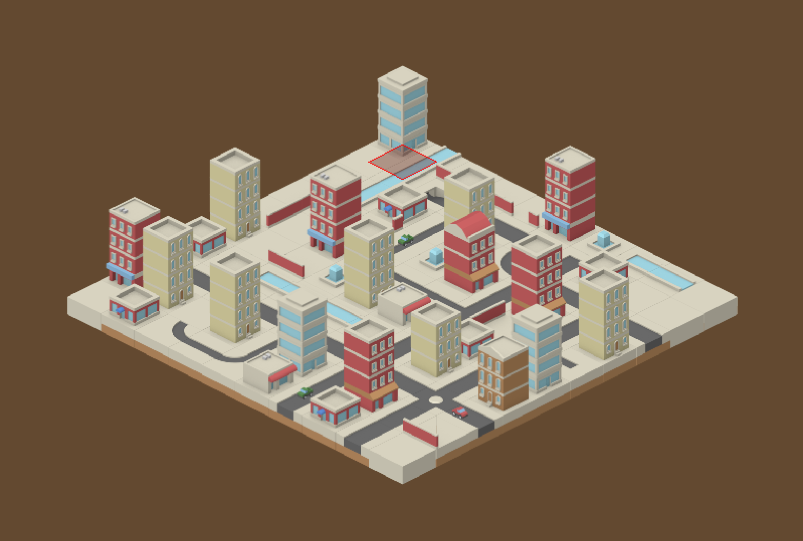
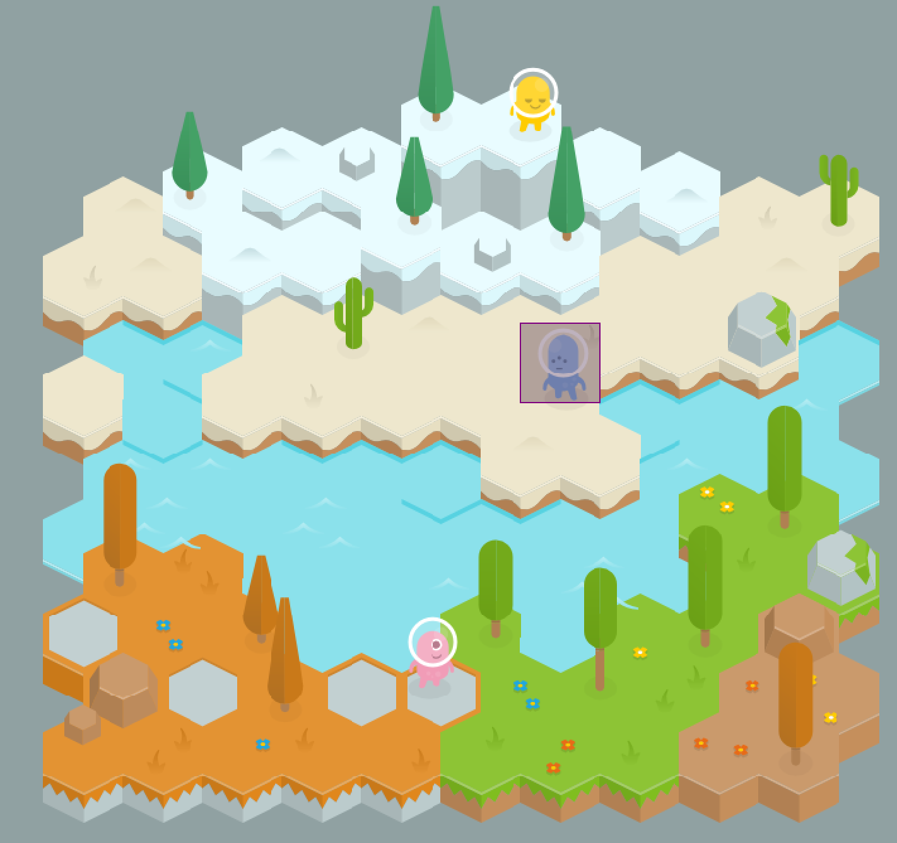
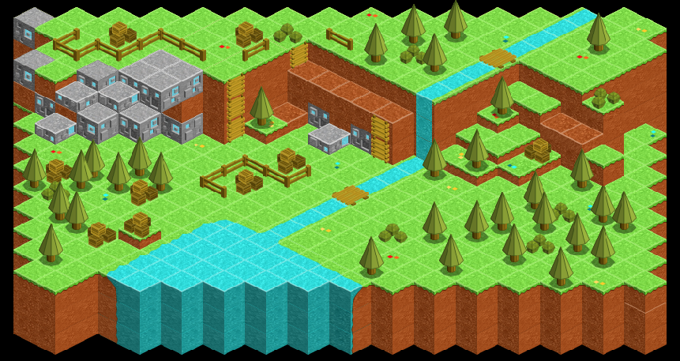

# Introduction

TMXLoader is used for loading .tmx assets created by [Tiled Map Editor](http://www.mapeditor.org/). It's a plugin for [jMonkeyEngine3](http://jmonkeyengine.org/).

You can download it here: https://github.com/jmecn/TMXLoader/releases.
Or use the [source](https://github.com/jmecn/TMXLoader).

[](https://github.com/jmecn/TMXLoader/actions/workflows/build.yml)

## How to use

maven

```xml
<dependency>
    <groupId>io.github.jmecn</groupId>
    <artifactId>tmx-loader</artifactId>
    <version>0.4.0</version>
</dependency>
```

gradle

```groovy
dependencies {
    implementation 'io.github.jmecn:tmx-loader:0.4.0'
}
```

## Example

```java
package io.github.jmecn.tiled.app;

import com.jme3.app.SimpleApplication;
import com.jme3.system.AppSettings;
import io.github.jmecn.tiled.TiledMapAppState;
import io.github.jmecn.tiled.TmxLoader;
import io.github.jmecn.tiled.core.TiledMap;

/**
 * Test loading tmx assets with TmxLoader.
 * @author yanmaoyuan
 *
 */
public class TmxLoaderExample extends SimpleApplication {

    @Override
    public void simpleInitApp() {
        // register it
        assetManager.registerLoader(TmxLoader.class, "tmx", "tsx");

        // load tmx with it
        TiledMap map = (TiledMap) assetManager.loadAsset("Desert/desert.tmx");

        // render it with TiledMapAppState
        stateManager.attach(new TiledMapAppState());

        TiledMapAppState tiledMap = stateManager.getState(TiledMapAppState.class);
        tiledMap.setMap(map);
        tiledMap.setViewColumn(20);
    }

    public static void main(String[] args) {
        AppSettings settings = new AppSettings(true);
        settings.setWidth(1280);
        settings.setHeight(720);
        settings.setSamples(4);
        settings.setGammaCorrection(false);

        TmxLoaderExample app = new TmxLoaderExample();
        app.setSettings(settings);
        app.start();
    }
}
```

## Screenshots

* Orthogonal Map



* Iso map



* Hex map



* Staggered map




